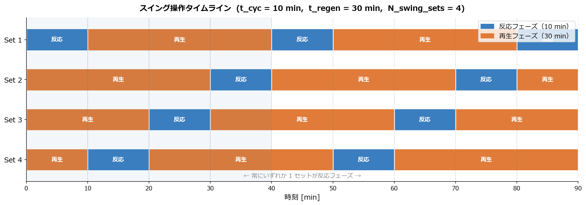

# SPEC: swing.py — PDH スイング反応器システム シミュレーター

**ファイルパス**: `units/reactors/swing.py`
**最終更新**: 2026-05-02（TAC 廃止・CAPEX のみ出力に変更）

---

## 目次

1. [シミュレータ概要](#1-シミュレータ概要)
2. [反応系](#2-反応系)
3. [物理モデルと計算手法](#3-物理モデルと計算手法)
4. [速度・熱力学モデル](#4-速度熱力学モデル)
5. [触媒失活モデル](#5-触媒失活モデル)
6. [スイング操作と装置計算](#6-スイング操作と装置計算)
7. [コスト計算（Bare Module Cost法）](#7-コスト計算bare-module-cost法)
8. [仮定一覧](#8-仮定一覧)
9. [データクラス定義](#9-データクラス定義)
10. [定数・パラメータ一覧](#10-定数パラメータ一覧)
11. [依存モジュール](#11-依存モジュール)
12. [使い方](#12-使い方)
13. [エラーハンドリング](#13-エラーハンドリング)

---

## 1. シミュレータ概要

### 何をシミュレートするか

プロパン脱水素（PDH: Propane DeHydrogenation）プロセスにおける **断熱固定床管型反応器（Adiabatic PFR）** のスイング操作システムをシミュレートする。

| 項目 | 内容 |
|---|---|
| 反応 | C₃H₈ → C₃H₆ + H₂（主反応）+ 2つの副反応 |
| 反応器型式 | 断熱・固定床・管型（PFR） |
| 操作方式 | スイング（反応と触媒再生を複数基で切り替え） |
| 触媒失活 | コーキングによる活性低下を時間積分で考慮 |
| 出力 | 後段分離工程向け時間平均ストリーム＋装置コスト |

### スイング操作とは

コーキングにより触媒活性が時間とともに低下するため、複数の反応器を交互に運転（反応フェーズ）と再生（再生フェーズ）に割り当て、プロセス全体としての連続運転を可能にする操作方式。



> 例: t_cyc = 10 min、t_regen = 30 min → N_swing_sets = 4。どの時刻の縦断面でも青（反応フェーズ）が必ず 1 セットだけ存在する。

---

## 2. 反応系

### 成分定義

| キー | 化学式 | 名称 |
|---|---|---|
| A | C₃H₈ | プロパン（反応物） |
| B | C₃H₆ | プロピレン（主生成物） |
| C | H₂ | 水素（主生成物） |
| D | C₂H₄ | エチレン（副生成物） |
| E | CH₄ | メタン（副生成物） |
| F | C₂H₆ | エタン（副生成物） |

### 反応式

| 番号 | 反応式 | 種別 |
|---|---|---|
| r1 | C₃H₈ → C₃H₆ + H₂ | 脱水素（主反応・可逆） |
| r2 | C₃H₈ → C₂H₄ + CH₄ | クラッキング（副反応・不可逆） |
| r3 | C₂H₄ + H₂ → C₂H₆ | 水素化（副反応・不可逆） |

### 化学量論行列

`_STOICH[i, j]` = 成分 `i` の反応 `j` に対する量論係数（行: 成分、列: r1/r2/r3）

|  | r1 | r2 | r3 |
|---|---|---|---|
| C₃H₈ | −1 | −1 | 0 |
| C₃H₆ | +1 | 0 | 0 |
| H₂ | +1 | 0 | −1 |
| C₂H₄ | 0 | +1 | −1 |
| CH₄ | 0 | +1 | 0 |
| C₂H₆ | 0 | 0 | +1 |

---

## 3. 物理モデルと計算手法

### 3-1. 全体フロー

```
入力 (DesignVars, FeedStream, FixedParams)
│
├─ 時間ループ: t = 0, Δt, 2Δt, ..., t_cyc  (n_time_samples 点)
│   └─ 空間ODE積分: z = 0 → z_cat  [_simulate_one_time]
│       └─ _ode_axial: dF/dz, dT/dz を solve_ivp (Radau) で解く
│
├─ 時間方向台形則積分 → F_out_avg, T_out_avg
├─ 予熱熱量計算 Q_preheat
├─ 装置計算 (N_parallel, N_swing_sets, V_vessel_actual)
├─ CAPEX 計算 (Bare Module Cost法)
│
└─ 出力 (SimulationResult)
```

### 3-2. 空間方向 ODE

状態ベクトル: `y = [F_A, F_B, F_C, F_D, F_E, F_F, T]`（単位: mol/s, K）

**物質収支**

$$\frac{dF_i}{dz} = \varepsilon \cdot A_{cross} \cdot \sum_j \nu_{ij} \cdot r_j
\quad \left[\mathrm{mol\,s^{-1}\,m^{-1}}\right]$$

**エネルギー収支（断熱）**

$$\frac{dT}{dz} = -\frac{(1-\varepsilon) \cdot A_{cross} \cdot \sum_j \Delta H_{rxn,j}(T) \cdot r_j}{\sum_i F_i \cdot C_{p,i}(T)}
\quad \left[\mathrm{K\,m^{-1}}\right]$$

**記号定義**

| 記号 | 意味 | 単位 |
|---|---|---|
| $F_i$ | 成分 $i$ のモル流量 | mol/s |
| $z$ | 軸方向位置（反応器入口 $z=0$） | m |
| $\varepsilon$ | 充填層空隙率 | — |
| $A_{cross}$ | 反応器断面積（$=\pi D^2/4$） | m² |
| $\nu_{ij}$ | 成分 $i$・反応 $j$ の量論係数（化学量論行列の $(i,j)$ 成分） | — |
| $r_j$ | 反応 $j$ の反応速度 | mol m⁻³_cat s⁻¹ |
| $T$ | 温度 | K |
| $\Delta H_{rxn,j}(T)$ | 温度 $T$ における反応 $j$ の反応エンタルピー | J mol⁻¹ |
| $C_{p,i}(T)$ | 温度 $T$ における成分 $i$ の定圧モル比熱 | J K⁻¹ mol⁻¹ |

**ソルバー設定**

| 項目 | 値 |
|---|---|
| メソッド | Radau（陰的 Runge-Kutta、剛性問題向け） |
| 相対許容誤差 `rtol` | 1×10⁻⁵ |
| 絶対許容誤差 `atol` | 1×10⁻⁸ |

### 3-3. 時間方向積分（台形則）

`t = 0` から `t = t_cyc` まで `n_time_samples`（デフォルト 20）点を等間隔サンプリングし、台形則で時間平均を算出する。

$$\overline{F}_{i,out} = \frac{1}{t_{cyc}} \int_0^{t_{cyc}} F_{i,out}(t)\, dt
\approx \frac{1}{t_{cyc}} \cdot \mathrm{trapz}(F_{i,out}(t_k),\, t_k)$$

**記号定義**

| 記号 | 意味 | 単位 |
|---|---|---|
| $\overline{F}_{i,out}$ | 成分 $i$ の出口モル流量のサイクル時間平均 | mol/s |
| $t_{cyc}$ | 1サイクルの反応フェーズ時間 | s |
| $F_{i,out}(t)$ | 時刻 $t$ における成分 $i$ の出口モル流量 | mol/s |
| $t_k$ | 等間隔サンプリング時刻（$k=0,1,\ldots,n_{samples}-1$） | s |

### 3-4. 予熱熱量

$$Q_{preheat} = \frac{3600}{10^9} \sum_i F_{i,in} \cdot \int_{T_{feed}}^{T_{in}} C_{p,i}(T)\, dT
\quad \left[\mathrm{GJ\,h^{-1}}\right]$$

$C_{p,i}(T)$ の積分は `PDHThermo.calc_enthalpy_change` による解析的計算。

**記号定義**

| 記号 | 意味 | 単位 |
|---|---|---|
| $Q_{preheat}$ | 予熱熱量 | GJ/h |
| $F_{i,in}$ | 成分 $i$ の入口モル流量 | mol/s |
| $T_{feed}$ | 加熱炉入口（予熱前）温度 | K |
| $T_{in}$ | 反応器入口温度 | K |
| $C_{p,i}(T)$ | 成分 $i$ の定圧モル比熱 | J K⁻¹ mol⁻¹ |

---

## 4. 速度・熱力学モデル

### 4-1. 反応速度式

**反応1（脱水素・可逆）**

$$r_1 = a \cdot k_1(T) \cdot \frac{P_A - P_B P_C / K_{eq}(T)}{1 + P_B / K_B(T)}
\quad \left[\mathrm{mol\,m_{cat}^{-3}\,s^{-1}}\right]$$

**反応2（クラッキング・不可逆）**

$$r_2 = k_2(T) \cdot P_A$$

**反応3（水素化・不可逆）**

$$r_3 = k_3(T) \cdot P_D \cdot P_C$$

**記号定義**

| 記号 | 意味 | 単位 |
|---|---|---|
| $r_j$ | 反応 $j$（$j=1,2,3$）の反応速度 | mol m⁻³_cat s⁻¹ |
| $a$ | 触媒活性係数（新鮮触媒 $a=1.0$、完全失活 $a=0.0$） | — |
| $k_j(T)$ | 温度 $T$ における反応 $j$ の速度定数 | 各反応依存 |
| $P_A$ | プロパン（C₃H₈）分圧 | Pa |
| $P_B$ | プロピレン（C₃H₆）分圧 | Pa |
| $P_C$ | 水素（H₂）分圧 | Pa |
| $P_D$ | エチレン（C₂H₄）分圧 | Pa |
| $K_{eq}(T)$ | 反応1（脱水素）の平衡定数 | Pa |
| $K_B(T)$ | プロピレン吸着平衡定数 | Pa |

### 4-2. 速度定数（修正 Arrhenius 型）

基準温度 $T_0 = 793.15$ K（= 520 °C）

$$k_i(T) = k_{0i} \cdot \exp\!\left(-\frac{E_{a,i}}{R} \left(\frac{1}{T} - \frac{1}{T_0}\right)\right)$$

$$K_B(T) = K_0 \cdot \exp\!\left(-\frac{\Delta H_{ads}}{R} \left(\frac{1}{T} - \frac{1}{T_0}\right)\right)$$

**記号定義**

| 記号 | 意味 |
|---|---|
| $k_i(T)$ | 温度 $T$ における反応 $i$ の速度定数（$T=T_0$ のとき $k_i(T_0)=k_{0i}$） |
| $k_{0i}$ | 反応 $i$ の前指数因子（基準温度 $T_0$ における速度定数値） |
| $E_{a,i}$ | 反応 $i$ の活性化エネルギー |
| $R$ | 理想気体定数 |
| $T$ | 反応温度 |
| $T_0$ | 速度定数基準温度（= 793.15 K = 520 °C） |
| $K_B(T)$ | プロピレン吸着平衡定数 |
| $K_0$ | 吸着定数の前指数因子（$T=T_0$ における $K_B$ 値） |
| $\Delta H_{ads}$ | プロピレン吸着エンタルピー |

| パラメータ | 値 | 単位 |
|---|---|---|
| $k_{01}$ | 9.787×10⁻⁵ | mol m⁻³ s⁻¹ Pa⁻¹ |
| $E_{a1}$ | 34.57 kJ/mol | — |
| $\Delta H_{ads}$ | −85.817 kJ/mol | — |
| $K_0$ | 3.46×10⁵ | Pa |
| $k_{02}$ | 8.682×10⁻⁷ | mol m⁻³ s⁻¹ Pa⁻¹ |
| $E_{a2}$ | 137.31 kJ/mol | — |
| $k_{03}$ | 4.406×10⁻⁸ | mol m⁻³ s⁻¹ Pa⁻² |
| $E_{a3}$ | 154.54 kJ/mol | — |
| $R$ | 8.31446 | J K⁻¹ mol⁻¹ |
| $T_0$ | 793.15 K | (= 520 °C) |

### 4-3. 平衡定数 $K_{eq}(T)$

反応1 C₃H₈ → C₃H₆ + H₂ の平衡定数 \[Pa\] を Kirchhoff の法則＋Gibbs-Helmholtz 式で厳密計算する（`PDHThermo.calc_keq`）。

1. $\Delta H^\circ(298)$、$\Delta G^\circ(298)$ を `THERMO_DATA` の生成エンタルピー・Gibbs エネルギーから算出
2. $\Delta S^\circ(298) = (\Delta H^\circ - \Delta G^\circ)/298.15$
3. Kirchhoff 積分: $\Delta H^\circ(T) = \Delta H^\circ(298) + \int_{298}^{T} \Delta C_p\, dT$（解析的）
4. エントロピー積分: $\Delta S^\circ(T) = \Delta S^\circ(298) + \int_{298}^{T} \Delta C_p/T\, dT$（解析的）
5. $\Delta G^\circ(T) = \Delta H^\circ(T) - T \cdot \Delta S^\circ(T)$
6. $K_{eq}[\mathrm{Pa}] = P_{STD} \cdot \exp\!\left(-\Delta G^\circ(T) / (RT)\right)$、$P_{STD} = 101325\,\mathrm{Pa}$

**記号定義**

| 記号 | 意味 | 単位 |
|---|---|---|
| $\Delta H^\circ(T)$ | 温度 $T$ における標準反応エンタルピー | J mol⁻¹ |
| $\Delta G^\circ(T)$ | 温度 $T$ における標準 Gibbs エネルギー変化 | J mol⁻¹ |
| $\Delta S^\circ(T)$ | 温度 $T$ における標準反応エントロピー | J K⁻¹ mol⁻¹ |
| $\Delta C_p$ | 反応の定圧比熱差（$=\sum_i \nu_i C_{p,i}$） | J K⁻¹ mol⁻¹ |
| $K_{eq}$ | 反応1の平衡定数（圧力次元） | Pa |
| $P_{STD}$ | 標準圧力（= 101325 Pa） | Pa |
| $R$ | 理想気体定数（= 8.31446 J K⁻¹ mol⁻¹） | J K⁻¹ mol⁻¹ |

### 4-4. 定圧比熱

$$C_{p,i}(T) = a_i + b_i T + c_i T^2 + d_i T^3 \quad [\mathrm{J\,K^{-1}\,mol^{-1}}]$$

多項式係数は `src/config.py` の `THERMO_DATA` に成分ごとに定義。

**記号定義**

| 記号 | 意味 |
|---|---|
| $C_{p,i}(T)$ | 温度 $T$ における成分 $i$ の定圧モル比熱 |
| $a_i,\, b_i,\, c_i,\, d_i$ | 成分 $i$ の多項式係数（触媒活性 $a$ とは無関係; `THERMO_DATA` に格納） |

### 4-5. 反応エンタルピー

$$\Delta H_{rxn,j}(T) = \sum_i \nu_{ij} \left(\Delta H^\circ_{f,i}(298) + \int_{298}^{T} C_{p,i}\, dT\right)$$

**記号定義**

| 記号 | 意味 | 単位 |
|---|---|---|
| $\Delta H_{rxn,j}(T)$ | 温度 $T$ における反応 $j$ の反応エンタルピー | J mol⁻¹ |
| $\nu_{ij}$ | 成分 $i$・反応 $j$ の量論係数 | — |
| $\Delta H^\circ_{f,i}(298)$ | 成分 $i$ の標準生成エンタルピー（298.15 K 基準） | J mol⁻¹ |
| $C_{p,i}$ | 成分 $i$ の定圧モル比熱（[4-4節](#4-4-定圧比熱)参照） | J K⁻¹ mol⁻¹ |

---

## 5. 触媒失活モデル

`src/catalyst_model.py` の `calculate_activity_a(T_celsius, t_min)` を使用。

### モデル概要

コーキングによる触媒活性の時間変化を **2次元スプライン補間**（`RectBivariateSpline`、kx=ky=3）でモデル化。

- データソース: `data/a_parameter_fitting.xlsx`（0〜30 min）
- 温度軸: 400, 450, 500, 550, 600, 650, 700 °C
- 時間軸: 0, 5, 10, 15, 20, 25, 30 min
- 出力: $a \in [0.0,\, 1.0]$（1.0 = 新鮮な触媒、0.0 = 完全失活）

### スイング.py での使い方の仮定

**触媒活性はサイクル内で空間方向に一定**（入口温度で代表させる）。ODE 積分の各時刻 $t$ において、$a(T_{in}, t)$ を事前に 1 回だけ評価し、その値を PFR 全長で定数として使用する。

```python
a = calculate_activity_a(T_in - 273.15, t_min)  # z方向に一定
```

---

## 6. スイング操作と装置計算

### 6-1. 触媒体積と並列基数

$$V_{cat,total} = A_{cross} \cdot z_{cat} \cdot \varepsilon$$

$$N_{parallel} = \max\!\left(\left\lceil \frac{V_{cat,total}}{V_{cat,max}}\right\rceil,\, 1\right)$$

- $V_{cat,max} = 200\,\mathrm{m^3}$（1基あたり上限）

### 6-2. スイングセット数と総基数

$$N_{swing,sets} = \left\lceil \frac{t_{regen}}{t_{cyc}} \right\rceil + 1$$

$$N_{reactors,total} = N_{parallel} \times N_{swing,sets}$$

- $t_{regen} = 30\,\mathrm{min}$（触媒再生時間、固定）
- +1 は「反応中 1 セット＋再生中 $\lceil t_{regen}/t_{cyc} \rceil$ セット」を確保するため

### 6-3. 容器体積

$$V_{vessel,actual} = \frac{V_{cat,total} / N_{parallel}}{\varepsilon} \quad [\mathrm{m^3}]$$

### 6-4. 触媒総量

$$W_{cat,total} = V_{cat,total} \times N_{swing,sets} \times \rho_p \quad [\mathrm{kg}]$$

**記号定義（6節共通）**

| 記号 | 意味 | 単位 |
|---|---|---|
| $V_{cat,total}$ | 1並列分に必要な総触媒充填体積 | m³ |
| $A_{cross}$ | 反応器断面積（$=\pi D^2/4$） | m² |
| $z_{cat}$ | 触媒層長さ | m |
| $\varepsilon$ | 空隙率 | — |
| $N_{parallel}$ | 並列基数（同時反応フェーズ中の基数） | — |
| $V_{cat,max}$ | 1基あたり最大触媒充填体積 | m³ |
| $\lceil \cdot \rceil$ | 天井関数（切り上げ整数） | — |
| $N_{swing,sets}$ | スイングセット数（反応+再生を合わせた切り替え組数） | — |
| $t_{regen}$ | 触媒再生時間 | min |
| $t_{cyc}$ | 1サイクルの反応フェーズ時間 | min |
| $N_{reactors,total}$ | システム全体の総反応器基数 | — |
| $V_{vessel,actual}$ | 1基あたりプロセス容器体積（触媒 + 空隙） | m³ |
| $W_{cat,total}$ | システム全体の触媒総量（再生中の基を含む） | kg |
| $\rho_p$ | 触媒充填密度 | kg/m³ |

---

## 7. コスト計算（Bare Module Cost法）

`src/cost_calculator.py` の関数を使用。対象装置は **縦型プロセス容器（Vertical process vessel）**。

### 7-1. 計算フロー

$$C_p^0 = 10^{\left(K_1 + K_2 \log_{10} A + K_3 (\log_{10} A)^2\right)}
\quad \left[\mathrm{USD,\, 2001年基準}\right]$$

$$F_p = \begin{cases}
\max\!\left(\dfrac{(P_g+1)\,D}{10.71 - 0.00756\,(P_g+1)} + 0.5,\ 1.0\right) & P_g > -0.5\,\mathrm{bar} \\[8pt]
1.25 & P_g \le -0.5\,\mathrm{bar}
\end{cases}$$

$$F_{BM} = B_1 + B_2 \cdot F_p \cdot F_M$$

$$C_{BM} = C_p^0 \cdot F_{BM} \cdot K_{swing}$$

$$C_{current} = C_{BM} \times \frac{\mathrm{CEPCI}_{current}}{\mathrm{CEPCI}_{base}}$$

$$C_{TM} = 1.18 \times C_{current} \times N_{reactors,total}$$

$$\mathrm{Reactor\_CAPEX} = C_{TM}\,[\mathrm{USD}] \times 110\,[\mathrm{JPY/USD}] \div 10^8
\quad [\text{億円}]$$

**記号定義**

| 記号 | 意味 | 単位 |
|---|---|---|
| $C_p^0$ | 基本コスト（Turton 相関式） | USD（2001年基準） |
| $K_1,\, K_2,\, K_3$ | 縦型プロセス容器の基本コスト相関係数 | — |
| $A$ | 容器体積（$= V_{vessel,actual}$） | m³ |
| $F_p$ | 圧力係数 | — |
| $P_g$ | ゲージ圧力（$= P_{abs}[\mathrm{bar}] - 1.01325$） | bar |
| $D$ | 容器内径 | m |
| $F_{BM}$ | ベアモジュール係数 | — |
| $B_1,\, B_2$ | ベアモジュール係数の相関定数 | — |
| $F_M$ | 材質係数（炭素鋼 = 1.0） | — |
| $C_{BM}$ | ベアモジュールコスト（1基） | USD（2001年基準） |
| $K_{swing}$ | スイング操作補正係数（配管・高温バルブ複雑化分） | — |
| $C_{current}$ | CEPCI 補正後コスト（1基） | USD |
| $\mathrm{CEPCI}_{current}$ | 現在の化学工学プラントコスト指数 | — |
| $\mathrm{CEPCI}_{base}$ | 基準年（2001年）の CEPCI 値 | — |
| $C_{TM}$ | 総建設費（間接費込み・全基合計） | USD |
| $\mathrm{Reactor\_CAPEX}$ | 反応器システム全体の資本費 | 億円 |

### 7-2. コスト定数

| パラメータ | 値 | 説明 |
|---|---|---|
| $K_1$ | 3.5565 | 基本コスト係数 |
| $K_2$ | 0.3776 | 基本コスト係数 |
| $K_3$ | 0.0905 | 基本コスト係数 |
| $A$ の適用範囲 | 0.1〜628 m³ | 容器体積 |
| $B_1$ | 1.49 | モジュール係数 |
| $B_2$ | 1.52 | モジュール係数 |
| $F_M$ | 1.0 | 材質係数（炭素鋼） |
| CEPCI_base | 397.0 | 2001年基準 |
| CEPCI_current | 544.0 | 2016年8月時点（仮置き、更新可） |
| $K_{swing}$ | 1.2 | スイング操作ペナルティ（配管・高温バルブ複雑化） |
| USD/JPY | 110.0 | 為替レート |
| 間接費係数 | 1.18 | 据付・間接費 |

> **注意**: CEPCI_current は `src/cost_parameters.py` の `CEPCI_CURRENT` を直接変更することで最新値に更新できる。

---

## 8. 仮定一覧

| # | 仮定 | 根拠・影響 |
|---|---|---|
| 1 | **圧力損失なし**（$P = P_{in} = \mathrm{const}$） | 各成分分圧を $P_i = (F_i/F_{total}) \times P_{in}$ で計算 |
| 2 | **断熱壁**（外部熱移動なし） | $dT/dz$ に対流・輻射項なし |
| 3 | **1次元プラグフロー**（軸方向拡散・径方向勾配なし） | PFR モデルの基本仮定 |
| 4 | **理想気体** | 分圧が mol 分率で線形 |
| 5 | **触媒活性は空間方向に均一**（入口温度で代表） | コーキングが軸方向温度プロファイルに依存しないという簡略化 |
| 6 | **再生後の触媒は完全回復**（$a(t=0) = 1.0$） | 各サイクル開始時に新鮮触媒として初期化 |
| 7 | **時間サンプリング間の内挿は台形則** | 20 点（デフォルト）で精度十分と仮定 |
| 8 | **CAPEX は縦型プロセス容器として推算** | 出典: 授業資料 プロセス設計R08-3.pdf 付録A Table A.1 |
| 9 | **OPEX は計算対象外**（CAPEX のみ出力） | 反応器単体では後段分離コスト等を確定できないため。TAC は上位スクリプトで全ユニット CAPEX を合算してから計算する |

---

## 9. データクラス定義

### 入力

#### `DesignVars` — 最適化変数

| フィールド | 型 | 単位 | 説明 |
|---|---|---|---|
| `T_in` | float | K | 反応器入口温度 |
| `z_cat` | float | m | 触媒層長さ |
| `t_cyc` | float | min | 1サイクル反応フェーズ時間 |
| `D` | float | m | 反応器内径 |

#### `FeedStream` — 入口流体条件

| フィールド | 型 | 単位 | 説明 |
|---|---|---|---|
| `F_in` | Dict[str, float] | kmol/h | 各成分入口モル流量（keys: 'C3H8','C3H6','H2','C2H4','CH4','C2H6'） |
| `T_feed` | float | K | 加熱炉入口温度（予熱前） |
| `P_in` | float | Pa | 反応器入口圧力 |

#### `FixedParams` — 固定定数・制約

| フィールド | デフォルト | 単位 | 説明 |
|---|---|---|---|
| `t_regen` | 30.0 | min | 触媒再生時間 |
| `V_cat_max_per_vessel` | 200.0 | m³ | 1基最大触媒量 |
| `eps` | 0.5 | — | 空隙率 |
| `rho_p` | 400.0 | kg/m³ | 触媒充填密度 |

> `FixedParams` は `__post_init__` で全フィールドが正値であることを検証する。

### 出力

#### `SimulationResult` — ルートオブジェクト

| フィールド | 型 | 説明 |
|---|---|---|
| `effluent` | EffluentStream | 出口流体情報 |
| `equipment` | EquipmentCost | 装置・経済情報 |
| `performance` | PerformanceMetrics | プロセス指標 |

#### `EffluentStream` — 出口流体

| フィールド | 単位 | 説明 |
|---|---|---|
| `F_out_avg` | kmol/h | 各成分出口モル流量の時間平均 |
| `T_out_avg` | K | 出口温度の時間平均 |
| `Q_preheat` | GJ/h | T_feed → T_in 予熱熱量 |
| `P_out` | Pa | 出口圧力（= P_in） |

#### `EquipmentCost` — 装置・経済性

| フィールド | 単位 | 説明 |
|---|---|---|
| `V_vessel_actual` | m³ | 1基プロセス容器体積 |
| `N_parallel` | — | 並列基数 |
| `N_swing_sets` | — | 切り替えセット数 |
| `N_reactors_total` | — | 総反応器基数 |
| `Catalyst_Weight_Total` | kg | システム全体触媒総量 |
| `Reactor_CAPEX` | 億円 | 全基分建設コスト（C_TM） |

#### `PerformanceMetrics` — プロセス指標

| フィールド | 単位 | 説明 |
|---|---|---|
| `Conversion` | % | プロパン単通反応率（時間平均） |
| `Selectivity` | % | プロピレン選択率（時間平均） |

$$\mathrm{Conversion} = \frac{F_{A,in} - F_{A,out}}{F_{A,in}} \times 100$$

$$\mathrm{Selectivity} = \frac{F_{B,out} - F_{B,in}}{F_{A,in} - F_{A,out}} \times 100$$

**記号定義**

| 記号 | 意味 | 単位 |
|---|---|---|
| $F_{A,in}$ | プロパン（A = C₃H₈）の入口モル流量 | mol/s |
| $F_{A,out}$ | プロパン（A = C₃H₈）の出口モル流量（時間平均） | mol/s |
| $F_{B,in}$ | プロピレン（B = C₃H₆）の入口モル流量 | mol/s |
| $F_{B,out}$ | プロピレン（B = C₃H₆）の出口モル流量（時間平均） | mol/s |

---

## 10. 定数・パラメータ一覧

### `src/config.py`

| 定数 | 値 | 単位 | 説明 |
|---|---|---|---|
| `R` | 8.31446 | J K⁻¹ mol⁻¹ | 理想気体定数 |
| `T0` | 793.15 | K | 速度定数基準温度（= 520 °C） |

### `src/cost_parameters.py`

`src/cost_parameters.py` に一元管理。[7-2節](#7-2-コスト定数) 参照。

### モジュール内定数

| 定数 | 値 | 説明 |
|---|---|---|
| `_PENALTY_CAPEX` | 1×10⁹ 億円 | 最適化への無効シグナル |
| `_T_REF` | 298.15 K | 反応エンタルピー計算基準温度 |

---

## 11. 依存モジュール

| モジュール | 使用箇所 | 役割 |
|---|---|---|
| `src.kinetics.PDHKinetics` | `calc_rate_constants` | k1, k2, k3, K_B の温度依存計算 |
| `src.thermo.PDHThermo` | `calc_rate_constants`, 予熱熱量, 反応エンタルピー | Cp, ΔH, K_eq の計算 |
| `src.catalyst_model.calculate_activity_a` | `calc_a` | 触媒活性パラメータ a(T, t) |
| `src.config.THERMO_DATA` | `_reaction_enthalpies` | 生成エンタルピー・Cp 多項式係数 |
| `src.cost_calculator.calc_reactor_capex_okuyen` | CAPEX 計算 | Bare Module Cost 法 |
| `scipy.integrate.solve_ivp` | `_simulate_one_time` | ODE ソルバー（Radau） |
| `numpy` | 全体 | 数値計算 |

---

## 12. 使い方

### 基本的な呼び出し

```python
from units.reactors.swing import (
    DesignVars, FeedStream, FixedParams, simulate_swing_reactor_system
)

design = DesignVars(
    T_in  = 873.15,   # K  (= 600 °C)
    z_cat = 5.0,      # m
    t_cyc = 15.0,     # min
    D     = 3.0,      # m
)

feed = FeedStream(
    F_in   = {'C3H8': 100.0, 'C3H6': 0.0, 'H2': 0.0,
              'C2H4': 0.0,   'CH4':  0.0, 'C2H6': 0.0},  # kmol/h
    T_feed = 300.0,   # K
    P_in   = 1.0e5,   # Pa
)

result = simulate_swing_reactor_system(design, feed, FixedParams())

print(result.performance.Conversion)        # %
print(result.performance.Selectivity)       # %
print(result.effluent.Q_preheat)            # GJ/h
print(result.equipment.Reactor_CAPEX)       # 億円
```

### 主要パラメータの調整

```python
# 時間サンプリング点数を増やして精度向上（デフォルト20）
result = simulate_swing_reactor_system(design, feed, FixedParams(), n_time_samples=50)

# 触媒充填密度や再生時間を変更する場合
fixed = FixedParams(t_regen=20.0, rho_p=500.0)

# CEPCI を最新値に更新する場合（src/cost_parameters.py を直接編集）
# CEPCI_CURRENT = 800.0  # 最新値に差し替え
```

### 最適化ループでの想定使用パターン

```python
def objective(x):
    T_in, z_cat, t_cyc, D = x
    design = DesignVars(T_in=T_in, z_cat=z_cat, t_cyc=t_cyc, D=D)
    r = simulate_swing_reactor_system(design, feed, fixed)
    return r.equipment.Reactor_CAPEX  # 最小化（TAC は上位スクリプトで合算）

# 無効条件では Reactor_CAPEX = 1×10⁹ 億円 が返るので最適化器に安全に渡せる
```

---

## 13. エラーハンドリング

### 方針

無効な入力・数値異常はすべて `_penalty_result()` を返して**クラッシュしない**。最適化器に対して大きなペナルティ値を送ることで「探索しない領域」を明示する。

### 入力バリデーション

`simulate_swing_reactor_system` 冒頭で以下をチェック。条件に合致した場合は即 `_penalty_result()` を返す。

| チェック対象 | 条件 |
|---|---|
| `design.t_cyc`, `design.z_cat`, `design.D` | ≤ 0 |
| `design.T_in`, `feed.T_feed`, `feed.P_in` | ≤ 0 |
| `feed.F_in` の各値 | 負値を含む |
| `feed.F_in` の合計 | = 0（空フィード） |
| `V_vessel_actual` | ≤ 0（内部計算後） |

### ODE 数値安定化

`_ode_axial` 内で以下のクリッピングを実施：

| 対象 | 処理 |
|---|---|
| モル流量 `F` | `np.maximum(y[:6], 0.0)` — 負値を 0 にクリップ |
| 温度 `T_local` | `np.clip(y[6], 300.0, 1500.0)` — 物理範囲外への発散を防止 |
| 平衡定数 `K_eq` | `max(K_eq, 1.0)` — 低温でのゼロ除算防止 |
| 吸着定数 `K_B` | `max(K_B, 1.0)` — 低温でのゼロ除算防止 |

### その他の保護

| 箇所 | 処理 |
|---|---|
| `solve_ivp` | `try/except Exception` で囲み、失敗時は `(None, None)` を返す |
| `calc_fp` | 分母 ≤ 0（非現実的超高圧）の場合、Fp = 10.0 を返す |
| `calc_cp0` | A ≤ 0 の場合、`ValueError` を raise |
| コスト計算全体 | `try/except` で囲み、失敗時は `_PENALTY_CAPEX` を使用 |
| Conversion / Selectivity | `np.clip(..., 0.0, 100.0)` |

### ペナルティ値

```
Reactor_CAPEX = 1×10⁹  [億円]
Conversion    = 0.0  [%]
Selectivity   = 0.0  [%]
```
